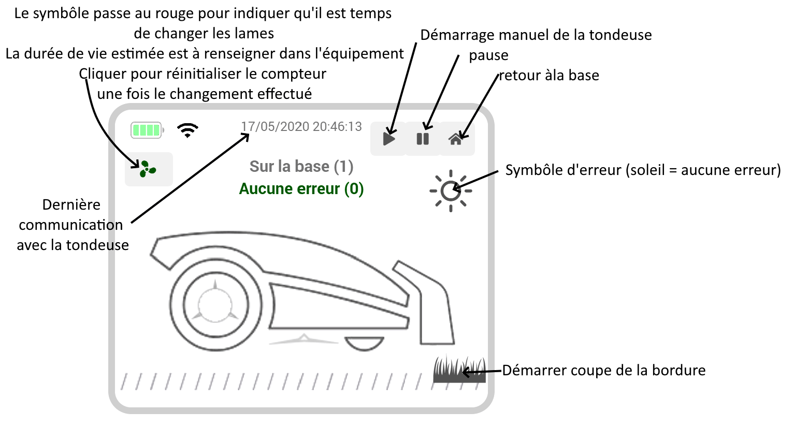

# Robots tondeuses Worx Landroid

## Présentation

Ce plugin permet de se connecter aux tondeuses worx Landroid modèles WIFI

### Configuration du plugin

La connexion vers la tondeuse se fait à partir d'un serveur cloud en utilisant le compte utilisé lors de l'enregistrement de la tondeuse.

Les identifiants correspondent à ceux de l'application mobile.
Vous devez attendre la fin de l'activation des dépendances pour permettre la communication avec la tondeuse par le protocole Mosquitto.

Une fois la sauvegarde effectuée, un nouvel équipement tondeuse va être créé automatiquement. En cas de soucis vous pouvez réactualiser les informations du cloud en utilisant la case à cocher correspondante et en effectuant une nouvelle sauvegarde.

L'arrêt du daemon permet de stopper la connexion avec la tondeuse.
En cas du défaillance il se peut que le Daemon soit à l'arrêt et vous pouvez tenter un redémarrage.

En cas d'arrêt prolongé, la meilleure solution est de désactiver le plugin.

### utilisation

Le nom par défaut = Nom de la tondeuse sur l'application mobile

Le dashboard affiche:
- Etat batterie
- bouton de retour maison
- bouton de démarrage
- bouton pause
- Rafraîchissement des infos courantes
- la date et heure de la dernière communication
- Distance et durée totale de fonctionnement
- Nombres de cycles de recharge
- Délai en minutes après la pluie
- changement du délai pluie (0 = on peut tondre sous la pluie, 30, 60, 120, 240)
- Etat de la tondeuse avec le code correspondant
- Description de l'erreur avec le code correspondant
- Le planning par jour avec l'heure de démarrage et d'arrêt
- Le bouton off permet de mettre les horaires à 0
- Le bouton on permet de récupérer les derniers horaires communiqués au plugin (10H - 17h par défaut)
- 'Bord.' signifie la coupe des bordures est planifié

Vous pouvez masquer les infos suivantes:
- errorCode, statusCode, totalDistance, batteryChargeCycle, rainDelay, cacher le jour de planification (schedule_startTime_#)

- le lancement de la coupe de la bordure n'est pas une fonction officielle et n'est pas dispo dans le plugin actuellement.

## Informations utiles pour les scénarios

Pour les scénarios, il peut être intéressant d'utiliser les actions 'on_today' et 'off_today' empêcher le démarrage un jour férié.
Penser à mettre off le matin et remettre à on avant minuit pour récupérer les horaires précédents

Il faut éviter d'envoyer plusieurs demandes de changement de planning sur des jours différents à des intervalles rapides. En effet le changement n'est enregistré dans le plugin qu'à la réponse du serveur. Tout le planning est envoyé à chaque fois et par conséquent on pourrait perdre la précédente demande.
Donc soit il faut attendre le l'actualisation de l'info dans l'équipement, soit il faut mettre une temporisation.

Pour le planning, les commandes possibles sont:
- on_0 à on_6 où le chiffre représente le numéro du jour de la semaine (0 =dimanche)
- off_0 à off_6
- on_today pour activer le jour courant
- off_today pour désactiver le jour courant
- set_schedule pour modifier le planning de tonte d'un jour donné. Par défaut l'action n'est pas visible. Le but étant de faire de la planification à l'aide d'un scénario mais il est possible de rendre visible sur le widget si besoin.
Format attendu: numéro jour;heure départ;durée en minutes;bordure Exemples :
1;10:00;120;1 => lundi, démarrage à 10:00 pendant 120 minutes, coupe la bordure
0;08:00;300;0 => dimanche, démarrage à 08:00 pendant 300 minutes, ne coupe pas la bordure

## Widget
- un widget (workAndroid) est disponible sur le market pour un affichage avec des images. Pour cela Il est possible d'utiliser l'info virtualInfo: cocher afficher dans la liste des commandes, sélectionner le widget dans la configuration avancée.
(Recherche équipement pour récupérer l'info d'un autre équipement)

## FAQ

>A quelle fréquence, les données sont-elles réactualisées?

Toutes les 2 minutes si la tondeuse est en activité et toutes les 30 minutes lorsqu'elle est en veille.

>Le plugin m'indique que la tondeuse est coincée mais ce n'est pas le cas, pourquoi?

Cela signifie que la tondeuse était coincée pendant quelques secondes et que le plugin a remonté l'info à ce moment là.
Il est possible de rafraîchir le statut de la tondeuse en utilisant le bouton "refreshValue"

>quels sont les modèles compatibles?
- WG757E
- WG796E.1
- WG797E.1
- WG798E
- WR101SI
- WR102SI
- WR104SI
- WR105SI
- WR106SI
- WR110MI
- WR111MI
- WR112MI
- WG799E
- WR113MI
- WR100SI
- WR101SI.1
- WR102SI.1
- WR103SI
- WR104SI.1
- WR105SI.1
- WR106SI.1
- WR110MI.1
- WR115MI
- WR130E
- WR141E
- WR142E
- WR143E
- WR153E
- WR155E
- WR140
- WR150

Un autre plugin worxLandroid est disponible pour les modèles M/L en version non cloud.

>Liste des codes erreur:
- 1: Bloquée
- 2: Soulevée
- 3: Câble non trouvé
- 4: En dehors des limites
- 5: Délai pluie
- 6: Close door to mow
- 7: Close door to go home
- 8: Moteur lames bloqué
- 9: Moteur roues bloqué
- 10: Timeout après blocage
- 11: Renversée
- 12: Batterie faible
- 13: Câble inversé
- 14: Erreur charge batterie
- 15: Delai recherche station dépassé

>Liste des codes statut:
- 0: Inactive
- 1: Sur la base
- 2: Séquence de démarrage
- 3: Quitte la base
- 4: Suit le câble
- 5: Recherche de la base
- 6: Recherche du câble
- 7: En cours de tonte
- 8: Soulevée
- 9: Coincée
- 10: Lames bloquées
- 11: Debug
- 12: Remote control
- 30: Retour à la base
- 31: Création des zones de tonte
- 32: Coupe la bordure

>La communication avec la tondeuse est perdue

Il peut arriver par moment de perdre la connexion avec la tondeuse, y compris avec l'application mobile.
Dans certains cas, le fait de réactualiser le code WIFI peut résoudre le problème.
(Faire comme si on voulait ajouter une nouvelle tondeuse sur l'appli mobile, appuyer 3 secondes sur le bouton OK de la tondeuse, renseigner le n° de série et le code WIFI correspondant)
Worx limite volontairement le nombre d'interrogations de l'état de la tondeuse (limite non connue) donc trop de "refresh" pourrait stopper la communication avec le cloud amazon. D'après les tests, il s'agit d'une limite quotidienne.

>Version mosquitto
Les versions mosquitto 1.3.x et antérieures ne sont pas compatibles avec le plugin. Le script d'installation (dépendances) doit pouvoir installer une version plus récente, toutefois il se peut que certaines distributions ne soient pas prises en compte.
Dans ce cas là, vous pouvez tenter de la mettre à jour manuellement et si possible m'informer afin que je puisse mettre à jour le script d'installation.

## Fonctionnement détaillé

Connexion vers des api worx pour récupérer: les infos utilisateurs, le certificat et les paramètres tondeuses:
https://api.worxlandroid.com:443/api/v2

Connexion au broker Mosquitto en fonction des liens et paramètres récupérés à partir des API précédentes

La clé publique se trouve à ce lien:
https://www.symantec.com/content/en/us/enterprise/verisign/roots/VeriSign-Class%203-Public-Primary-Certification-Authority-G5.pem

## Changelog

[Voir la page dédiée](changelog.md)
